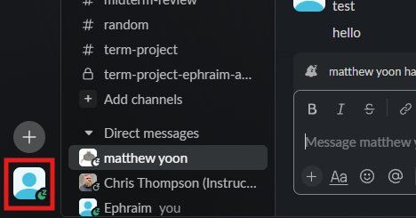
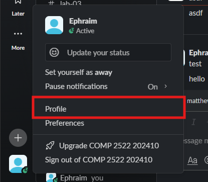
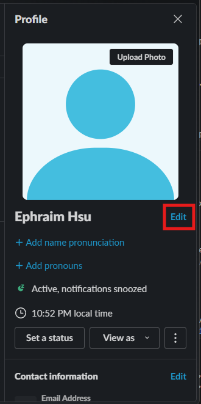
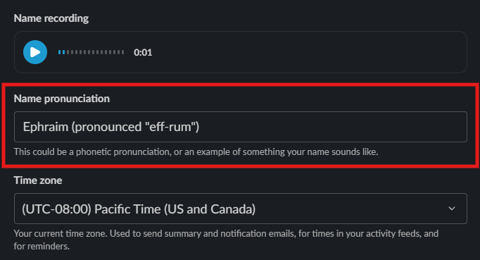
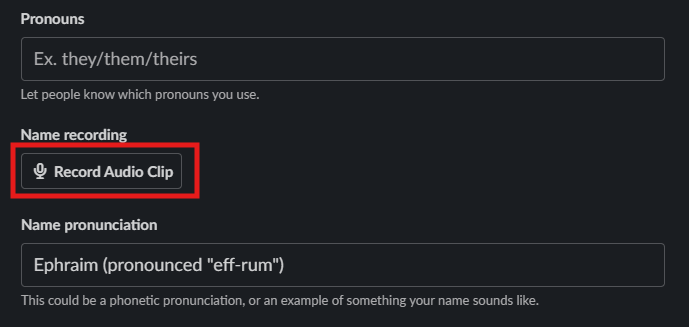
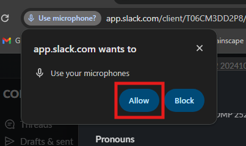
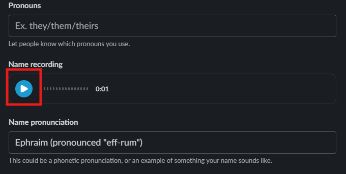
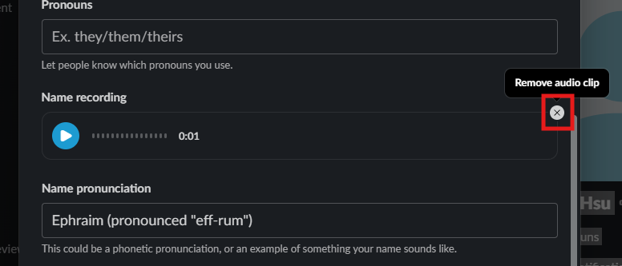
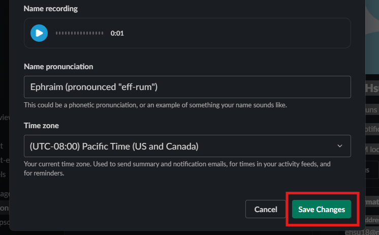
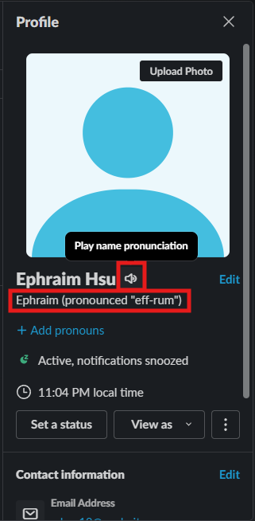

# How to Add Your Name's Pronunciation to Your Profile
Slack provides a quick and easy way to inform others on how to pronounce your name. Accommodate others and provide a guide to pronouncing your name by using this feature.

In this section you will provide a text and audio guide to pronouncing your name inside your profile.
## Steps to Access Your Profile and Add Your Name Pronunciation

1. Click your profile picture labeled with your *username* on the bottom left.
<figure markdown="span">
    { loading=lazy  width="400"}
    <figcaption>The Profile icon highlighted with a red square</figcaption>
</figure>
!!! success
    If steps have been followed correctly, then a popup menu will appear

2. Click on the **Profile** button on the popup menu.
<figure markdown="span">
    { loading=lazy width="400"}
  <figcaption>The Profile button highlighted with a red square</figcaption>
</figure>
!!! success
    If steps have been followed correctly, then a right side panel labeled "**Profile**" should be visible

3. Click on the **Edit** button in the **Profile** page.
<figure markdown="span">
    { loading=lazy width="400"}
  <figcaption>The Edit button highlighted with a red square</figcaption>
</figure>
!!! success
    If steps have been followed correctly, then a popup menu will appear
!!! note
    You can also click the **+Add name pronounciation** to quickly add a text based pronunciation guide

4. Add text to textbox labeled **name pronunciation**.
<figure markdown="span">
    { loading=lazy width="400"}
  <figcaption>The name pronunciation textbox highlighted with a red square</figcaption>
</figure>

5. Click on **Record Audio Clip** button.
<figure markdown="span">
    { loading=lazy  width="400"}
  <figcaption>The Record Audio Clip button highlighted with a red square</figcaption>
</figure>

!!! note
    If slack already has permission to use your microphone then you can skip step 6

!!! warning 
    you must allow slack to use your microphone to complete this task. If you select **Never Allow**, **Block**, or the **X** that will close the popup, please navigate to the **[Troubleshooting Page](trouble.md)**. 

6. Click on **Allow**.
<figure markdown="span">
    { loading=lazy  width="400"}
  <figcaption>The Allow button in the popup highlighted with a red square</figcaption>
</figure>
!!! note
    your popup dialog buttons may be labeled differently depending on your version of Google Chrome. Avoid clicking on the one that is most similar to a denial

7. Say your name into your microphone.
!!! success
    If steps have been followed correctly, then wavefroms will appear where the **Record Audio Clip** button was previously

8. Click on the blue **play** button to listen to your recording.
<figure markdown="span">
    { loading=lazy  width="400"}
  <figcaption>The play button highlighted with a red square</figcaption>
</figure>
!!! note
    if you are unsatitsfied with your recording, click the **Remove audio clip** button to delete the recording and repeat steps 5 and 7
    <figure markdown="span">
    { loading=lazy  width="400"}
    <figcaption>The remove audio clip button highlighted with a red square</figcaption>
    </figure>

9. Click on the **Save Changes** button.
<figure markdown="span">
    { loading=lazy  width="400"}
  <figcaption>The save changes button highlighted with a red square</figcaption>
</figure>
!!! success
    if all steps have been followed, there will be **play name pronunciation** button to the right of your *username* and the text guide under.
    <figure markdown="span">
    { loading=lazy  width="400"}
    <figcaption>The play name pronunciation button and text guide highlighted with red squares</figcaption>
    </figure>

## Conclusion
By the end of this section, you will have successfully completed and learnt how to:

- Add a text guide to pronounce your name to you profile.
- Add a audio guide to pronounce your name to your profile.

Congratulations! 🎉 Your colleagues can now learn how to pronounce your name. Click the link below to learn how to send a file through a DM:

**[Send a File using DM](SendAFileDM.md)**