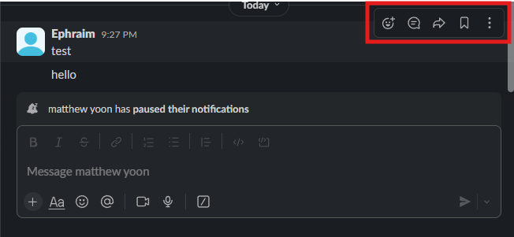
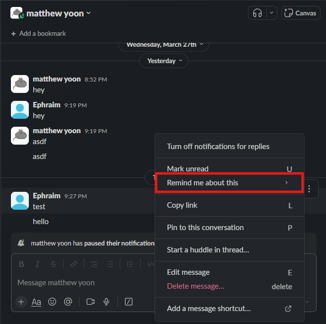
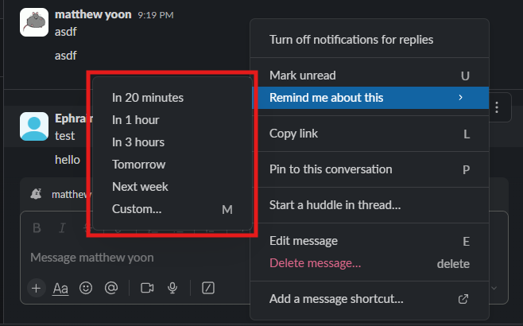
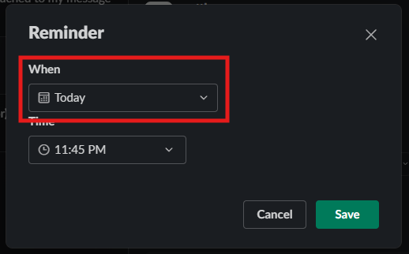
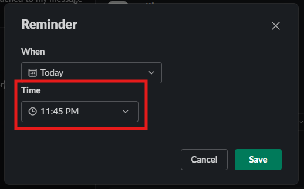
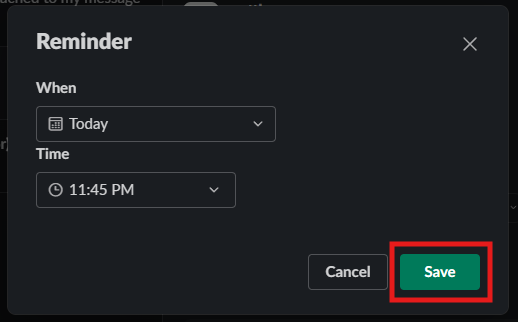
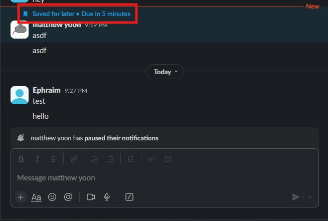

# How to Mark a Message as Unread and Set a Reminder for it
You will not always have the time to read all the details of a message and after viewing a message you lose the notification regarding said message. This can be annoying as we do not want to lose the reminder to check the message, but also need to check if the message is urgent. Slack has tools to help keep the reminder after viewing the message. 

In this section you will reset the unread marker and set a reminder for a message.

## Steps to Mark a message Unread and set a Reminder

1. Navigate to message you want to mark as unread.

2. Hover over the message with your mouse.
!!! success
    if steps have been followed correctly, then a popup menu should be visible
    <figure markdown="span">
        { loading=lazy align=left width="400"}
    <figcaption> The message popup menu highlighted with a red square</figcaption>
    </figure>

3. Click on the three vertical dots button labeled **more actions**.

<figure markdown="span">
    { loading=lazy align=left width="400"}
    <figcaption> The more actions button highlighted with a red square</figcaption>
</figure>

4. Click on "**Mark unread**" option on popup menu.
<figure markdown="span">
    { loading=lazy align=left width="400"}
    <figcaption> The Mark unread option highlighted with a red square</figcaption>
</figure>
!!! note
    you can also use the keyboard shortcut U

!!! note
    at this point you have succesfully marked the message as unread. Then following steps detail setting a reminder for the message
    
5. Repeat step 2 and 3

6. Click on the **Remind me about this** button.
<figure markdown="span">
    { loading=lazy align=left width="400"}
    <figcaption> The Remind me about this button highlighted with a red square</figcaption>
</figure>

7. Select a preset time interval or custom time from the popup menu.
<figure markdown="span">
    { loading=lazy width="400"}
    <figcaption> The preset time interval or custom time from the popup menu highlighted with a red square</figcaption>
</figure>

!!! note
    if you selected a preset time interval then you have complted setting a reminder, the next steps detail setting a custom time

8. Select a date for reminder.
<figure markdown="span">
    { loading=lazy align=left width="400"}
    <figcaption> The date drop down menu highlighted with a red square</figcaption>
</figure>

9. Select a time for the reminder.
<figure markdown="span">
    { loading=lazy align=left width="400"}
    <figcaption> The time drop down menu highlighted with a red square</figcaption>
</figure>

10. Click on the **Save** button
<figure markdown="span">
    { loading=lazy align=left width="400"}
    <figcaption> The save button highlighted with a red square</figcaption>
</figure>

!!! success
    if all steps have been followed correctly, then your message should be highlighted with blue with text indicating your set *time* for your reminder
    <figure markdown="span">
    { loading=lazy align=left width="400"}
    <figcaption>Example of a successful reminder being set</figcaption>
    </figure>
<pre>

</pre>
## Conclusion
By the end of this section, you will have completed and learnt how to:

- Mark a message as unread.
- Set a reminder for a message.

Congratulations! 🎉 You can now read a message and maintain the unread mark and notification. Click the link below to learn how to trouble shoot issues you may face in completing this task or any of the others:

**[Troubleshooting](trouble.md)**