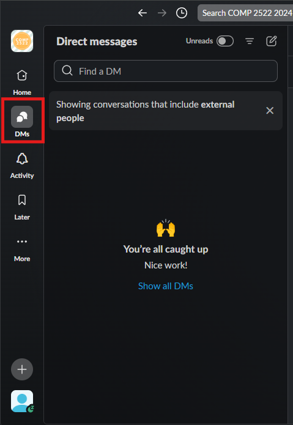
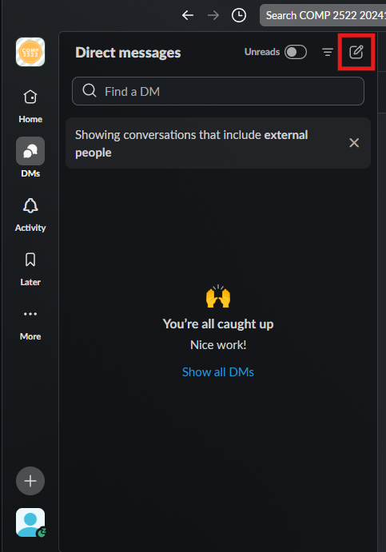
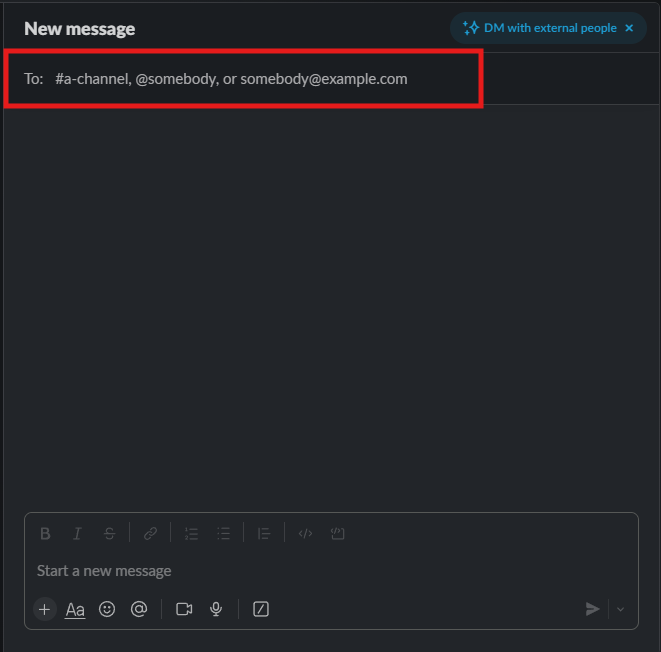
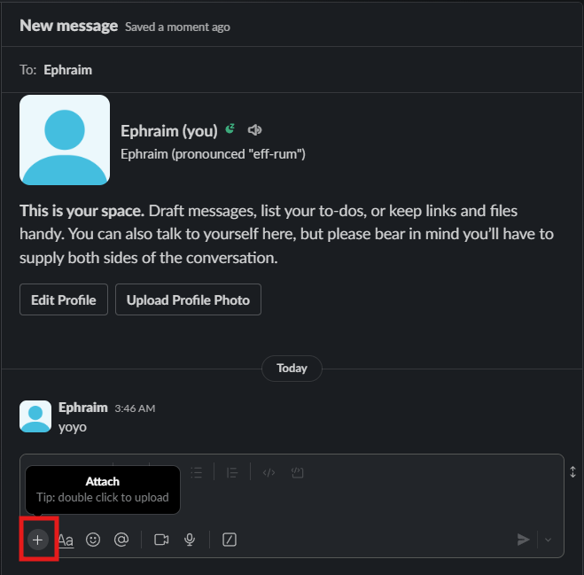
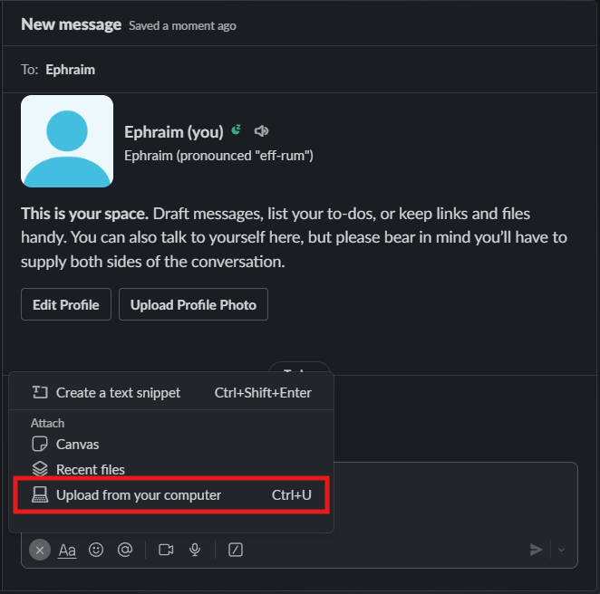
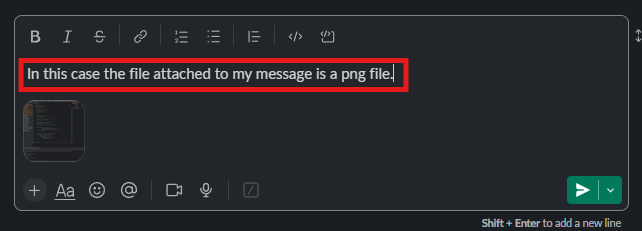
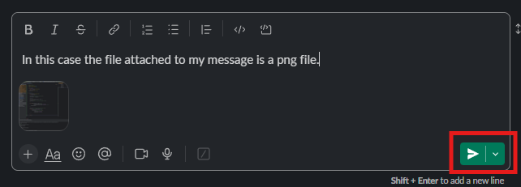
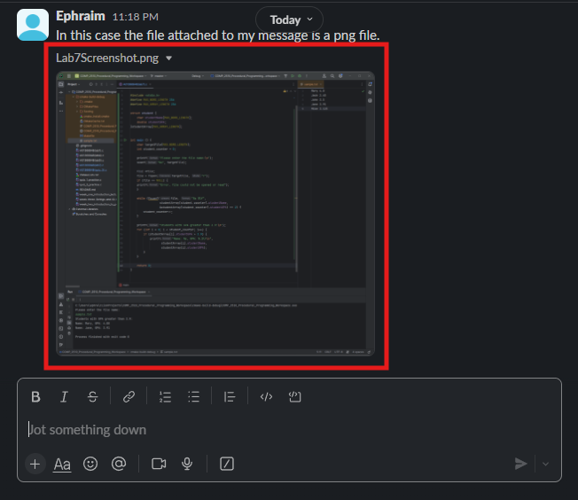

# How to Send A File Through a DM
As a student, when working on a group project, you may be required to share files with each other. Although this seems trivial and can be done in many ways, Slack provides a streamlined process in which this can be done so that your file sharing and communication can happen all in one place.

In this section you will create a new DM and send a file to one of your colleagues.
## Steps to Sending a File Through a DM
1. Click on the **DMs** button on the left side navigation bar.
<figure markdown="span">
    { loading=lazy  width="400"}
  <figcaption>The DMs button highlighted with a red square in the left naviagiton bar</figcaption>
</figure>

2. Click on the **New Message** icon.
<figure markdown="span">
    { loading=lazy  width="400"}
  <figcaption>The New Message icon highlighted with a red square</figcaption>
</figure>
!!! success
    If steps have been followed correctly, then a new message panel will be opened

3. Add recipient to the textbox labelled "**To:**" to the "**New Message**" panel.
<figure markdown="span">
    { loading=lazy  width="400"}
  <figcaption>The "To:" textbox highlighted with a red square</figcaption>
</figure>
!!! note
    you can also click a user under the tab labelled "**Direct Messages**" under the leftside channel listings. Users can be differentiated from channels by their respective profile pictures

4. Click on **Attach** icon labelled "**+**"
<figure markdown="span">
    { loading=lazy  width="400"}
  <figcaption>The Attach icon highlighted with a red square</figcaption>
</figure>

5. Click on **Upload from your computer** 
<figure markdown="span">
    { loading=lazy  width="400"}
  <figcaption>The Upload from your computer button highlighted with a red square</figcaption>
</figure>
!!! note
    You can also use the keyboard shortcut ctrl + U
!!! success
    if steps have been followed correctly, then a file explorer popup will have appeared

6. Select the file you would like to send.

7. Click **open** in the file explorer.

8. (optional) Add message to **New Message** text box.
<figure markdown="span">
    { loading=lazy  width="400"}
  <figcaption>Example of a message being included in the textbox</figcaption>
</figure>

9. Click on the green **Send now** button.
<figure markdown="span">
    { loading=lazy  width="400"}
  <figcaption>The Send now button highlighted with a red square</figcaption>
</figure>
!!! note
    you can use the keyboard shortcut enter
!!! success
    if all steps have been followed correctly, then you will see your message and your embedded file in the **Direct Message** panel
    <figure markdown="span">
    { loading=lazy  width="400"}
  <figcaption>Your message and your embedded file in the **Direct Message** panel</figcaption>
</figure>

## Conclusion
By the end of this section, you will have completed and learnt how to:

- Access the direct messages panel.
- Start a direct message with a specifec user.
- Send a file, with the option to include a message, through a DM.

Congratulations! 🎉 You can now send your colleagues files in the same place you communicate with them. Click the link below to learn how to mark messages as unread and set a reminder for them:

**[Mark a Message Unread and set a Reminder](MarkUnread.md)**