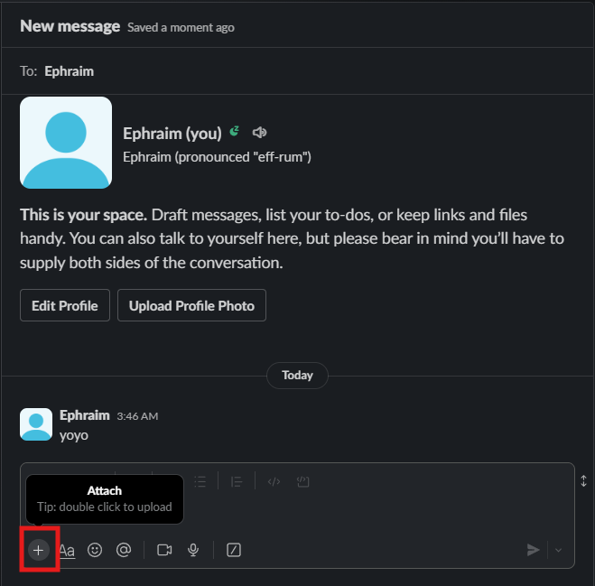

# How to Edit Your Profile
## Overview
Slack provides a quick and eazy way to inform others on how to pronounce your name. Accomadate others and provide a guide by taking advantage of this tool.

1. Click your profile picture labeled with your *username* on the bottom left.
<figure markdown="span">
    { loading=lazy align=left width="400"}
  <figcaption> The New Message icon highlighted with a red square</figcaption>
</figure>
!!! success
    If steps have been followed correctly, then a popup menu will appear

2. Click on the **Profile** button on the popup menu
<figure markdown="span">
    { loading=lazy align=left width="600"}
  <figcaption>The Profile button highlighted with a red square</figcaption>
</figure>
!!! success
    If steps have been followed correctly, then a right side panel labeled "**Profile**" should be visible

3. Click on the **Edit** button 
<figure markdown="span">
    { loading=lazy align=left width="600"}
  <figcaption>The Edit button highlighted with a red square</figcaption>
</figure>
!!! success
    If steps have been followed correctly, then a popup menu will appear
!!! note
    You can also click the **+Add name pronounciation** to quickly add a text based pronunciation guide

4. Add text to textbox labeled **name pronunciation**
<figure markdown="span">
    { loading=lazy align=left width="600"}
  <figcaption>The name pronunciation textbox highlighted with a red square</figcaption>
</figure>

5. Click on **record Audio Clip** button
<figure markdown="span">
    { loading=lazy align=left width="600"}
  <figcaption>The record Audio Clip button highlighted with a red square</figcaption>
</figure>

!!! note
    If slack already has permission to use your microphone then you can skip step 6

!!! warning 
    you must allow slack to use your microphone to complete this task. If you select **Never Allow**,**block**, or the **X** that will close the popup and trouble shooting will be necessary. 

6. Click on **allow this time**
<figure markdown="span">
    { loading=lazy align=left width="600"}
  <figcaption>The allow button in the popup highlighted with a red square</figcaption>
</figure>
!!! note
    your popup dialog buttons may be labeled differently depending on your version of Google Chrome. Avoid clicking on the one that is most similar to a denial

7. Say your name into your microphone
!!! success
    If steps have been followed correctly, then wavefroms will appear where the **record Audio Clip** button was previously

8. Click on the blue **play** button to check your recording
<figure markdown="span">
    { loading=lazy align=left width="600"}
  <figcaption>The play button highlighted with a red square</figcaption>
</figure>
!!! note
    If you are unsatitsfied with your recording, then click the **Remove Audio Clip** button to delete the recording and repeat step 5 and 7.
    <figure markdown="span">
    { loading=lazy align=left width="600"}
    <figcaption>The allow button in the popup highlighted with a red square</figcaption>
    </figure>

9. Click on the **Save Changes** button
<figure markdown="span">
    { loading=lazy align=left width="600"}
  <figcaption>The save changes button highlighted with a red square</figcaption>
</figure>
!!! success
    If all steps have been followed, there will be **play name pronunciation** button to the right of your *username* abd the text guide under.

