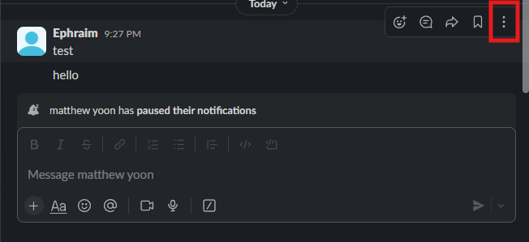
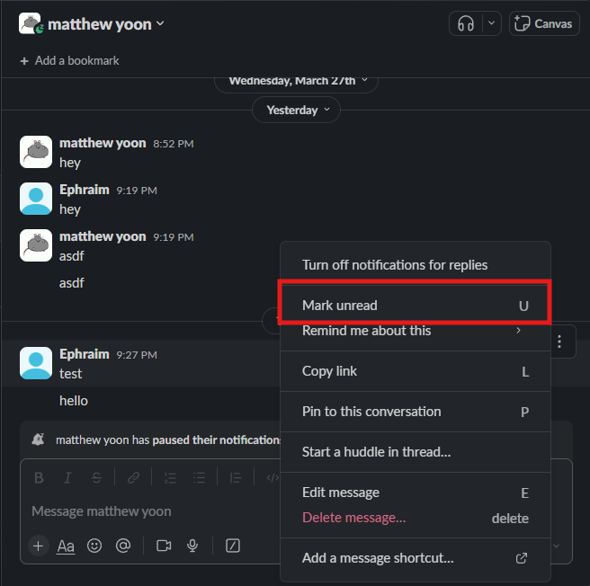
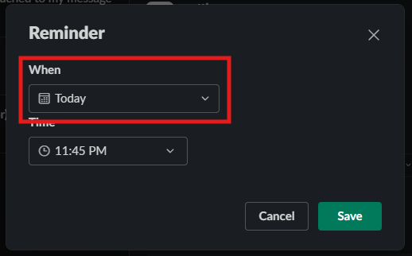

# How to Mark a Message Unread and Set a Reminder
## Overview
You will not always have the time to read all the details of a message and after viewing a message you lose the notification regarding said message. This can be annoying as we do not want to lose the reminder to check the message, but also need to check if the message is urgent. Slack has tools to help keep the reminder after viewing the message. 

In this section you will reset the unread marker and set a reminder for a message.

1. Navigate to message you want to mark unread

2. Hover over the message with your mouse
!!! success
    If steps have been followed correctly, then a popup menu should be visible
    <figure markdown="span">
        { loading=lazy align=left width="600"}
    <figcaption> The New Message icon highlighted with a red square</figcaption>
    </figure>

3. Click on the three vertical dots button labeled **more actions**
 <figure markdown="span">
        { loading=lazy align=left width="600"}
    <figcaption> The more actions button highlighted with a red square</figcaption>
    </figure>

4. Click on "**Mark Unread**" option on popup menu
<figure markdown="span">
    { loading=lazy align=left width="600"}
    <figcaption> The Mark Unread option highlighted with a red square</figcaption>
</figure>

!!! note
    At this point you have succesfully marked the message as Unread. Then next steps details setting the reminder.
5. Repeat step 2 and 3

6. Click on "**Remind Me About This**" 
<figure markdown="span">
    { loading=lazy align=left width="600"}
    <figcaption> The Remind Me About This option highlighted with a red square</figcaption>
</figure>

7. Select a preset time interval or custom from the popup menu
<figure markdown="span">
    { loading=lazy align=left width="600"}
    <figcaption> The Remind Me About This option highlighted with a red square</figcaption>
</figure>

!!! note
    If you selected a preset time interval then you have complted setting a reminder. The next steps details setting a custom time/

8. Select Date for reminder
<figure markdown="span">
    { loading=lazy align=left width="600"}
    <figcaption> The date drop down menu highlighted with a red square</figcaption>
</figure>

8. 1. Click on the desired date on the calander
<figure markdown="span">
    { loading=lazy align=left width="600"}
    <figcaption> The calander menu highlighted with a red square</figcaption>
</figure>

8. 2. Select the time for the reminder
<figure markdown="span">
    { loading=lazy align=left width="600"}
    <figcaption> The time drop down menu highlighted with a red square</figcaption>
</figure>

8. 3. Click on the desired time
<figure markdown="span">
    { loading=lazy align=left width="600"}
    <figcaption> The time menu highlighted with a red square</figcaption>
</figure>

9. Click on the **Save** button
<figure markdown="span">
    { loading=lazy align=left width="600"}
    <figcaption> The save button highlighted with a red square</figcaption>
</figure>

!!! success
    If all steps have been followed correctly, then your message should be highlighted with blue with text indicating your  set *time* for your reminder
    <figure markdown="span">
    { loading=lazy align=left width="600"}
    <figcaption>Example of a successful reminder being set</figcaption>
    </figure>
